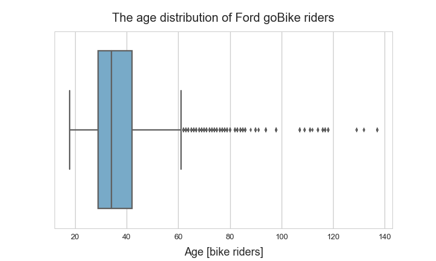
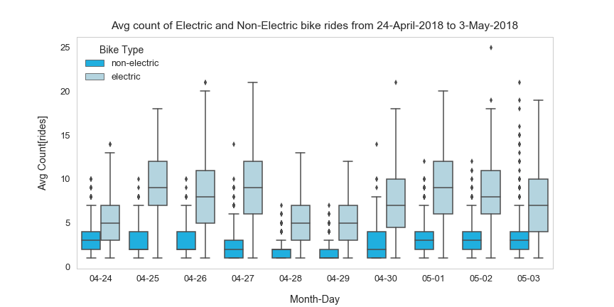

# Dataset Exploration Title: Bike sharing analysis with Ford GoBike data

## by Vallela Kavya

## Ford GoBike System Data
### Dataset Overview:

This data set includes information about **individual rides made in a bike-sharing system covering the greater San Francisco Bay area**.
 
Note that this dataset will require some data wrangling in order to make it tidy for analysis. 
 
There are multiple cities covered by the linked system, and multiple data files will need to be joined together if a full year’s coverage is desired.This data set includes information about individual rides made in a bike-sharing system covering the greater San Francisco Bay area. 
Note that this dataset will require some data wrangling in order to make it tidy for analysis. 
There are multiple cities covered by the linked system, and multiple data files will need to be joined together if a full year’s coverage is desired.
 The data contains four parts, including station, status, trip, and weather data. The station data is for bike stations at which users can pickup or return their bikes. The status section is the number of bikes and docks available for a given station and minute. The trip section represents an individual bike trip. And weather represents the weather for a specific day and zip code.
 The crime data is provided by the San Francisco Police Department, Santa Clara County Police Department, Redwood City Police Department, and Palo Alto Police Department. We used this data to count how many crimes occurred in the same zip code locations as the bike stations. The education and income data is provided by United States Census Bureau, which has a detailed education and income reports.
Bike share programs provide an environmentally friendly and healthy alternative to commuting within and exploring a city. However, Ford GoBike currently expends extra energy in order to consistently check on the condition of their bikes.
 
In addition, there was another announcement on April 24th 2018 that Ford GoBike would do a pilot launch of their electric bike service. So, I would like to find who might be especially interested of the news.

### Data

This project used the following dataset, which are available in (Datasource: https://s3.amazonaws.com/fordgobike-data/index.html)
 

## Summary of Findings

1. Setup Environment and Read data 
2. Filter data to include reasonable member age range. 
3. Filter data only to include San Francisco Rides. 
4. How fast the Ford goBike is growing? 
5. How does rides trend vary per age, gender, weekday, and hour of a day? 
6. How does subscribers and customers behave differently? 
7. Which docks are used more frequently? 
8. When and where 'bike share for all' members use Ford goBike? 
9. How is the trend of electric bike rides and which age group favors E-Bike more? 
10. Top 100 most frequently used paths 

### Tech Stacks

The project is mainly written in Python 3.6. I used pandas and numpy for data analysis, and used seaborn, and matplotlib for data visualization. 
 
In addition, Some plots are plotted in R with Ipython, such as Bokeh and gglot2.
%matplotlib inline

import pandas as pd
import numpy as np
import matplotlib.pyplot as plt
import matplotlib.ticker as ticker
import seaborn as sns
import datetime
import math
import calendar

#from bokeh.plotting import figure, output_notebook, show # bokeh plotting library
# We'll show the plots in the cells of this notebook
#output_notebook()

from bokeh.io import output_file, show, output_notebook
from bokeh.models import ColumnDataSource, GMapOptions
from bokeh.plotting import gmap, figure

sns.set(color_codes=True)
sns.set(rc={'figure.figsize':(12.5,9.7)})
## Key Insights for Presentation

### 1. The age distribution of Ford goBike rider

This Univariate Exploration boxplot is chosen for presentation as this plot decides the distributon of age group people goes for bike ridings. 
Compare to exploration , here the plot is more polished; 
    The background grid lines of boxplot are removed.
 
    The color of the plot is changed to basecolor palatte.
 
    The font size of the title and axes also modified.

### 2. Which age group favors e-bike more?

Suprisingly, 10 to 20 years user group seems to show the most interest in the e-bike, seeing that the percentage of e-bike rides of all the rides by 10 to 20 years old users is around 10%.
 
Also, the younger a rider is, the more likely the rider would be fond of electric bike rides.

This boxplot describes about the people favour to electric bikes and non electric bikes.
 
The changes made compare to exploration are, 
The color of the box plots are changed form lime and green to basecolor and lightskyblue for differentiation between electric and non-electric biek riders. 
The legend title font size and location of legend is also modified. 
the title font size is reduced.

## References:
 
1. I got jinja2 exception when i run the exploration ipynb file to covnert it into slides by hiding hide.I got refernece from here about the exception;
https://stackoverflow.com/questions/21692387/jinja2-exception-handling
 
 
2. To study little about bokeh models aI go through this site which explains clearly about bokeh;
https://bokeh.pydata.org/en/latest/docs/reference/models/map_plots.html
 
 
3. To know about matplotlib ticker formattings I studied here; 
https://matplotlib.org/gallery/ticks_and_spines/tick-formatters.html
 
 
4. To know more about How to Calculate the Haversine distance, I have go through from these links; 
https://www.movable-type.co.uk/scripts/latlong.html   https://www.vcalc.com/wiki/vCalc/Haversine+-+Distance
 
 
5. To find out how to download bokeh plots from notebook; 
https://bokeh.pydata.org/en/latest/docs/user_guide/export.html
 
 
6. For matplotlib axes;
https://matplotlib.org/gallery/subplots_axes_and_figures/axes_demo.html#sphx-glr-gallery-subplots-axes-and-figures-axes-demo-py
  
7. https://stackoverflow.com/questions/44931834/pandas-drop-function-error-label-not-contained-in-axis?rq=1
  
8. https://stackoverflow.com/questions/36605923/python-set-background-of-a-box-in-a-boxplot
  
9. https://www.google.com/search?q=how+to+remove+background+color+in+a+boxplot+using+python&oq=how+to+remove+background+color+in+a+boxplot+using+python&aqs=chrome..69i57.10632j0j4&sourceid=chrome&ie=UTF-8
  
10. https://www.google.com/search?q=how+to+set+axis+lines+in+plot+using+python+seaborn&oq=how+to+set+axis+lines+in+plot+using+python+seaborn&aqs=chrome..69i57.10974j0j4&sourceid=chrome&ie=UTF-8
